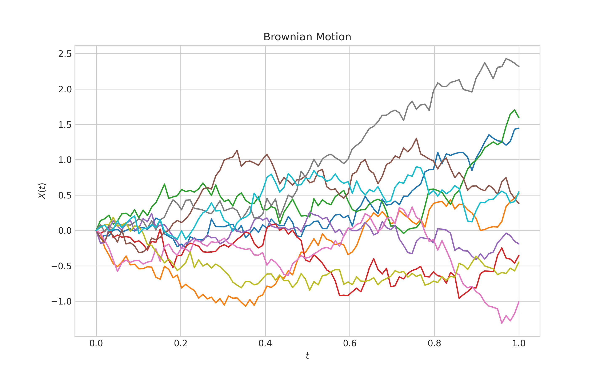
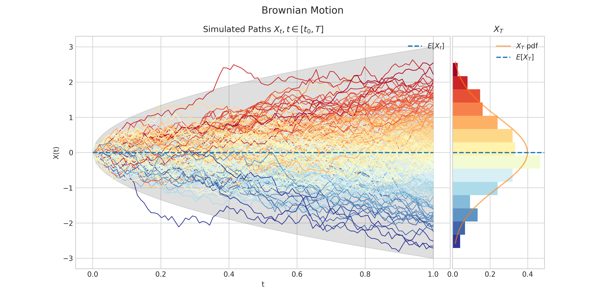
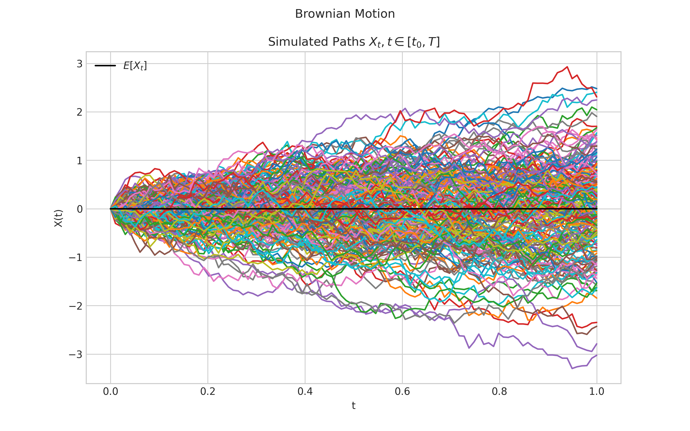
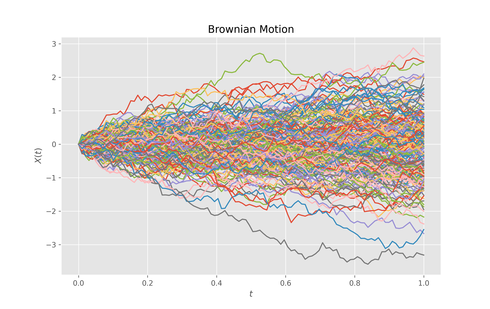
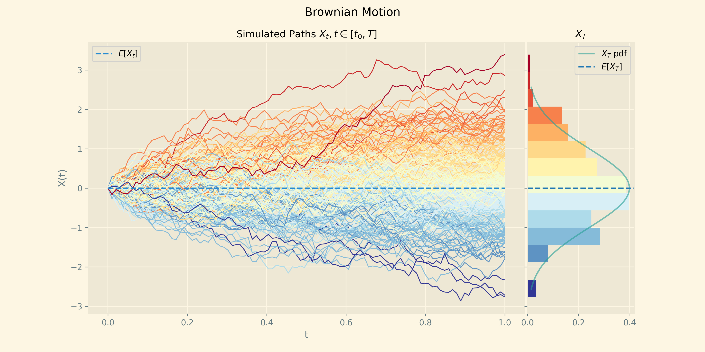
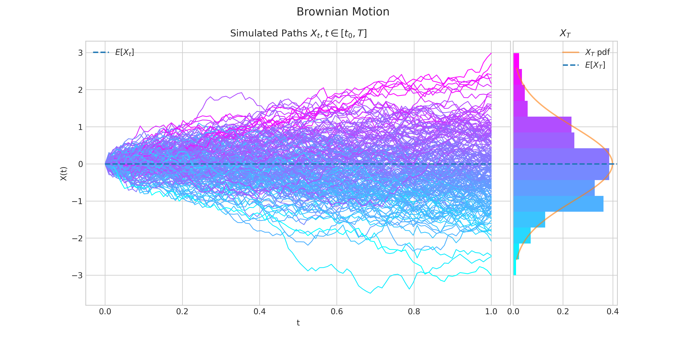

Quick-Start Guide
=================

To start using ``replica``, import the stochastic processes you want and create an
instance with the required parameters. For example, we create an instance of a standard
Brownian motion as follows.

.. code-block:: python

    from replica.processes import BrownianMotion

    brownian = BrownianMotion()

.. note::
    All processes instances  will be defined on a finite interval :math:`[0,T]`. Hence, the end point
    :math:`T` is a required argument to create an instance of a process. In all cases :math:`T=1,` by default.

The simulate() method
~~~~~~~~~~~~~~~~~~~~~
Every process class has a ``simulate`` method to  generate a number of trajectories/paths.
The ``simulate`` methods require two parameters:

- ``n`` for the number of steps in each path
- ``N`` for the number of paths

and will return a list with ``N`` paths generated from the specified process.

For example,
we can simulate 10 paths, each one with 100 steps, from a standard Brownian motion as follows.

.. code-block:: python

    from replica.processes import BrownianMotion

    brownian = BrownianMotion()
    paths = brownian.simulate(n=100, N=10)

.. note::
    Each path is a ``numpy array`` which contains
    ``n`` points/steps corresponding to the values of the process at evenly spaced times over the
    interval :math:`[0,T],` i.e.,

    .. math::
        \left\{X \left(\frac{i T }{n-1}\right), i=0,\cdots, n-1\right\}.

The plot() method
~~~~~~~~~~~~~~~~~
Every process class has a ``plot`` method for generating a simple chart
with showing the required simulated trajectories/paths.
Similarly to the ``simulate`` methods, the ``plot`` methods require two parameters:

- ``n`` for the number of steps in each path
- ``N`` for the number of paths

.. code-block:: python

    from replica.processes import BrownianMotion

    brownian = BrownianMotion()
    brownian.plot(n=100, N=10)

The draw() method
~~~~~~~~~~~~~~~~~
Every process class has a ``draw`` method which generates a more interesting
visualisation of the simulated trajectories/paths.

The ``draw`` method also require two parameters:

- ``n`` for the number of steps in each path
- ``N`` for the number of paths

In addition, there are two optional boolean parameters

- ``marginal`` which enables/disables a subplot showing the marginal distribution of $X_T$. This parameters is defaulted to ``True``.
- ``envelope`` which enables/disables a the ability to show envelopes made of confidence intervals. This is defaulted to `False``.

This allows us to produce four different charts.

.. code-block:: python

    from replica.processes import BrownianMotion

    brownian = BrownianMotion()
    brownian.draw(n=100, N=200)

.. image:: _static/brownian_motion_quickstart_02.png

.. code-block:: python

    from replica.processes import BrownianMotion

    brownian = BrownianMotion()
    brownian.draw(n=100, N=200, envelope=True)

.. code-block:: python

    from replica.processes import BrownianMotion

    brownian = BrownianMotion()
    brownian.draw(n=100, N=200, marginal=False)

.. code-block:: python

    from replica.processes import BrownianMotion
    brownian = BrownianMotion()
    brownian.draw(n=100, N=200, marginal=False, envelope=True)

.. image:: _static/brownian_motion_quickstart_05.png

Charts Customisation
~~~~~~~~~~~~~~~~~~~~

Both ``plot`` and ``draw`` methods allow chart customisation via a ``style``
parameter which leverages the style sheet feature.

The default style for all charts is ``"seaborn-v0_8-whitegrid"``. Visit the matplotlib `Style
sheet reference <https://matplotlib.org/stable/gallery/style_sheets/style_sheets_reference.html>`_
for more details and examples of the different styles.

.. code-block:: python

    from replica.processes import BrownianMotion
    brownian = BrownianMotion()
    brownian.plot(n=100, N=200, style='ggplot')

.. code-block:: python

    from replica.processes import BrownianMotion
    brownian = BrownianMotion()
    brownian.draw(n=100, N=100, style='Solarize_Light2')

Finally, the method ``draw`` also offers the ability to customise the color map
which is used. This is done via the parameter ``colormap``

The default color map is ``"RdYlBu_r"``. Visit the matplotlib tutorial `Choosing Colormaps in Matplotlib  <https://matplotlib.org/stable/tutorials/colors/colormaps.html>`_
for more details and examples of the different color maps that you can use.

.. code-block:: python

    from replica.processes import BrownianMotion
    brownian = BrownianMotion()
    brownian.draw(n=100, N=100, colormap="cool")

